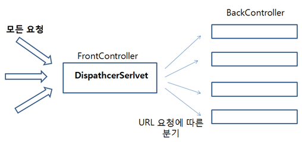
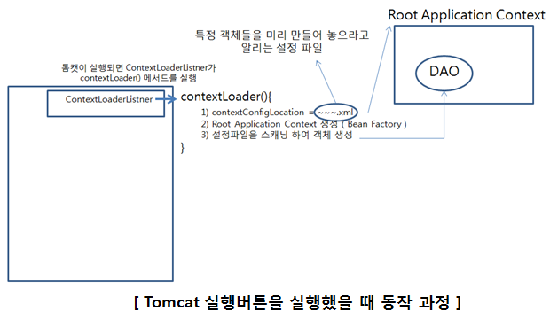
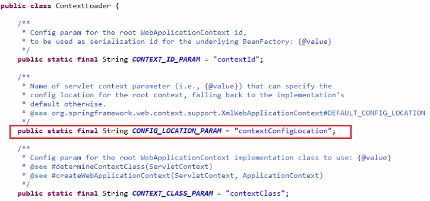
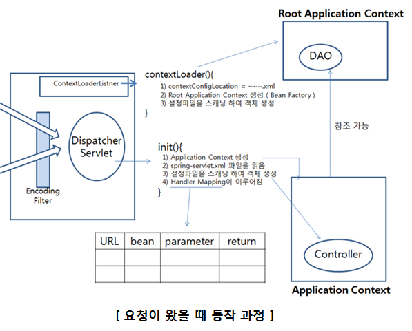
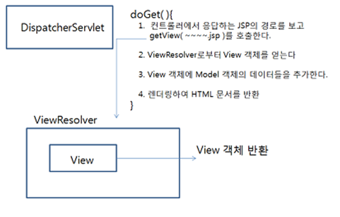
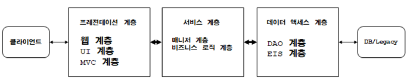
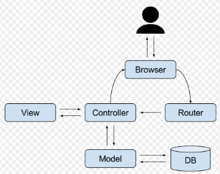

# victoleespring
victolee spring blog 2018

https://victorydntmd.tistory.com/

---
# 20180324.01

메이븐 ( Maven )은 war 또는 jar 파일을 빌드( build ), 라이브러리 의존성( dependency ) 해결, 컴파일( compile ) , 배포 ( deploy ) 등을 해결해주는 도구

> Tip) IDE가 이클립스라면 복붙 하신 다음에 ctrl + shift + f 를 누르시면 자동 줄맞춤이 됩니다.

Maven이 라이브러리를 제대로 받아오지 못할 경우
maven은 중앙( central )에서 라이브러리를 받아오는데, 잘못 받아오는 경우가 있어서 제대로 동작하지 않을 때가 있습니다.
그럴 때는 아래의 경로에 가셔서 repository 폴더를 지우고 중앙으로부터 다시 받는 것이 좋습니다.

사용자경로\.m2\repository

그리고 이클립스에서 프로젝트를 우클릭
-> maven
-> Update project 를 클릭하여 라이브러리를 다시 가져올 수 있도록 refresh를 할 수 있습니다.

---
# 20180324.02

#### DispatcherServlet

```xml
<!-- Dispatcher Servlet(Front controller) -->
<servlet>
        <servlet-name>spring</servlet-name>
        <servlet-class>org.springframework.web.servlet.DispatcherServlet</servlet-class>
</servlet>
<servlet-mapping>
        <servlet-name>spring</servlet-name>
        <url-pattern>/</url-pattern>
</servlet-mapping>
```
DispatcherServlet은 모든 요청을 받아들이는 Servlet
즉 앞단에서 모든 요청을 스프링이 받아들인 후에 URL에 대응되는 컨트롤러를 찾아가 특정 메서드를 실행
컨트롤러를 어떻게 찾아가는지, 어떤 메서드를 실행하는지는 어노테이션으로 명시
**DispatcherServlet이 모든 요청을 받아들여 적절한 메서드가 실행될 수 있도록 분기시킨다**



#### Spring Servlet Configuration

> 스프링 컨테이너는 객체들을 관리하는 bean Factory

```xml
        <context:annotation-config />
        <context:component-scan base-package="com.victolee.springTest.controller"/>
```

1. `<context:annotation-config />`
어딘가( Application Context )에 이미 등록된 bean들의 어노테이션 활성화를 위해 사용
**즉 어딘가에서 미리 만들어 놓은 객체를 가져다 쓰기 위한 @Autowired 와 @Qualifier 같은 어노테이션을 해석할 것이라는 의미**

스프링 컨테이너는 객체들을 관리한다고 했었는데, 관리하는 방식은 어딘가에서 생성된 객체를 가져다 쓰는 방식입니다.
즉 미리 생성된 객체를 가져다 쓰기 위해서는 `@Autowired`라는 어노테이션을 사용하는데,
`<context:annotation-config />`는 이 어노테이션을 활성화 하겠다는 의미가 됩니다.

        DI는 이 과정을 통해 일어나는 것입니다.

2. `<context:component-scan>`
어노테이션을 활성화 하는 일을 수행
**`@Component`, @`Repository`, `@Service`, `@Controller`, `@RestController`, `@ControllerAdvice`, `@Configuration` 과 같은 어노테이션을 스캔 하겠다는 의미**
*추가적인 설정을 통해 사용자가 직접 작성한 어노테이션을 추가, 제거 할 수 있습니다.*

#### Hello World

spring-servlet.xml 파일에서 scan 범위( base-package ) 이름으로 패키지 생성
**어노테이션 스캔은 base-package 로 작성한 패키지 내에서만 이루어지기 때문에 패키지 이름이 다르면 스캔을 하지 않습니다.**

```java
package victoleespring.controller;

import org.springframework.stereotype.Controller;
import org.springframework.web.bind.annotation.RequestMapping;

@Controller
public class HelloController {
	
	@RequestMapping
	public String hello() {
		return "/WEB-INF/views/hello.jsp";
	}
}
```
클래스 선언부 위에 `@Controller`를 작성하면
스프링은 이 클래스를 컨트롤러로 인식하여 다음의 과정을 수행합니다.

1) 모든 요청을 받아들이는 DispatcherServlet이 특정 요청을 처리할 수 있도록 `@Controller` 어노테이션이 작성된 클래스를 읽어들입니다.
2) 그 클래스의 많은 어노테이션 중 `@RequestMapping` 어노테이션을 읽어들입니다.
3) 어떤 URL이 왔을 때 어떤 메서드를 실행한 것인지를 **Mapping** 합니다.

**즉 위 예제의 내용은 /hello라는 요청이 오면 hello.jsp 페이지를 렌더링 하겠다는 의미입니다.**

        @Controller을 작성하면 스프링이 해당 클래스를 컨트롤러라고 인식을 하고,
        @RequestMapping을 작성하면 URL과 메서드가 매핑이 이루어진다고 이해하시면 됩니다.

#### Hello world View
```html
<%@ page language="java" contentType="text/html; charset=UTF-8" pageEncoding="UTF-8"%>
<!DOCTYPE html PUBLIC "-//W3C//DTD HTML 4.01 Transitional//EN" "http://www.w3.org/TR/html4/loose.dtd">
<html>
<head>
<meta http-equiv="Content-Type" content="text/html; charset=UTF-8">
<title>Insert title here</title>
</head>
<body>
        <h1>Hello World</h1>
</body>
</html>
```
---
# 20180324.03

#### 톰캣 버튼을 실행했을 때 일어나는 동작


1. 톰캣을 실행하기 전에 개발자는 톰캣의 설정파일인 `web.xml` 파일에 `<context-param>`으로 전역 파라미터를 설정합니다. 파라미터의 이름은 **contextConfigLocation**이고 **어떤 객체들을 미리 만들어 놓을지가 작성된 설정파일의 경로**를 값으로 할당해 놓습니다.
```xml
<!-- Context parameter -->
<context-param>
        <param-name>contextConfiguration</param-name>
        <param-value>/WEB-INF/applicationContext.xml</param-value>
</context-param>
```
2. 이어서 톰캣이 실행되면 수행할 클래스( 리스너 )의 이름을 같은 파일인 web.xml에 작성합니다.
```xml
<!-- Context Loader Listener -->
<listener>
        <listener-class>org.springframework.web.context.ContextLoaderListener</listener-class>
</listener>
```
톰캣을 실행하면 `<listener>`가 등록되어 있는 **ContextLoaderListner** 객체를 호출하는데, 이 객체는 내부적으로 부모 객체를 실행합니다.
부모 객체는 **ContextLoader**이며 이 객체에서 Root Application Context를 생성하는데, 이 컨테이너에는 웹과 관련이 없는 객체들을 저장합니다.
예를들면 DAO 객체들은 웹과 직접적인 관련이 없는 객체입니다.(단지 DB에 접근하기 위한 객체들일 뿐이죠.)

3. Root Application Context 컨테이너에 객체들을 생성하기 위해서, 1단계에서 작성한 전역 파라미터 이름인 contextConfigLocation의 값으로 설정된 `/WEB-INF/applicationContext.xml`을 읽어 들입니다.


ContextLoader 클래스에는 `CONFIG_LOCATION_PARAM`라는 상수가 정의되어 있는데, 기본 값으로 문자열 contextConfigLocation이 할당되어 있습니다.

그래서 **1단계에서 전역 파라미터 이름을 contextConfigLocation으로 작성한 것**입니다.

그리고 **contextConfigLocation는 사실, 설정 파일 경로( WEB-INF/applicationContext.xml )를 의미**하구요.

`WEB-INF/applicationContext.xml`은 **어떤 객체들을 미리 생성해 놓을지를 정의한 설정 파일**이라고 했었습니다.

즉 `Context Loader Listner`를 통해 `applicationContext.xml`를 읽어들이고, `Root Application Context 컨테이너`에 **웹과 관련이 없는 객체들이 생성**됩니다.

4. applicationContext.xml은 3 - layer 구성된 component를 정의
>3 layer architecture는 Controller - Service - DAO로 정의된 구조

```xml
<context:annotation-config />

<context:component-scan back-package="com.victolee.guestbook.repository">
        <context:include-filter type="annotation"
                expression="org.springframework.stereotype.Repsoitory" />
        <context:include-filter type="annotation"
                expression="org.springframework.stereotype.Service" />
        <context:include-filter type="annotation"
                expression="org.springframework.stereotype.Component" />
</context:component-scan>
```
.xml 파일에 설정을 하는 대신에 어노테이션으로 설정을 하겠다는 의미이며, 어노테이션을 스캔 할 범위인 base-package를 정의
**즉 base-package 범위 내에서 @Repository , @Service , @Component 어노테이션을 스캔하겠다는 의미**

예를들어 GuestbookDAO를 컨테이너에 추가하고 싶다면 base-package안에 GuestbookDAO 클래스를 생성한 후 3 - layer 계층에 맞는 어노테이션을 추가하면 됩니다.
```java
import org.springframework.stereotype.Repository;

@Repository
public class GuestbookDAO {
        // TO-DO
}
```
**이렇게 @Repository를 등록하면 Root Application Context, 즉 bean Factory에 해당 객체가 싱글톤 형태로 저장이 됩니다.**

        정리하면 ApplicationContext.xml 파일에 의존성 주입을 위한 객체들을 미리 정의합니다.
        여기서는 그 방식을 어노테이션으로 해결 하겠다고 했으며,
        스프링이 어노테이션을 스캔할 수 있도록 범위를 지정해줬습니다.
        그러면 톰캣이 실행되었을 때 ContextLoaderListner에 의해 ContextLoader가 실행되어
        컨테이너에 의존성 해결을 위한 객체들을 생성하게 됩니다.


#### 요청이 왔을 때 실행 동작


1. `web.xml` 파일에 작성했던 코드
```xml
<!-- Dispatcher Servlet(Front controller) -->
<servlet>
        <servlet-name>spring</servlet-name>
        <servlet-class>org.springframework.web.servlet.DispatcherServlet</servlet-class>
</servlet>
<servlet-mapping>
        <servlet-name>spring</servlet-name>
        <url-pattern>/</url-pattern>
</servlet-mapping>
```
" 모든 요청이 왔을 때 DispactherServlet의 init() 메서드가 실행되도록 해라 "는 의미가 담겨있는 코드입니다.
물론 한 번 요청이 왔었다면 init() 메서드는 Servlet의 라이프 사이클에 따라 생략이 되겠죠.

Servlet 매핑을 할 때 작성한 `<servlet-name>`이 `spring`이므로 `DispatcherServlet`의 `init()` 메서드는 `spring-servlet.xml` 파일을 읽어들입니다.

spring-servlet.xml 파일의 이름은 **'servlet-name의 값' + '-servlet.xml'** 이 되어 생성된 이름입니다.

2. spring-servlet.xml 파일의 코드
```xml
<context:annotation-config />
<context:component-scan
        base-package="com.victoleespring.controller" />
```
즉 **어떤 요청이 오면 `DispatcherServlet`은 `spring-servlet.xml` 파일을 읽어서
"`base-package 범위 내`에 있는 어노테이션을 스캐닝 한다"는 의미**가 담겨있는 코드

3.  base-package에 속한 클래스의 선언부에 `@Controller` 어노테이션을 추가하면 스캐닝이 이루어지고, **Web Application Context 컨테이너에 해당 객체를 저장**

```java
import org.springframework.stereotype.Controller

@Controller
public calss GuestbookController {

}
```
4. 톰캣을 실행 했을 때 생성했던 컨테이너(Root Application Content)에 있는 DAO 객체를 불러올 수 있습니다.
**`@Autowired` 어노테이션을 통해 미리 생성된 객체인 DAO를 사용 할 수 있으며, 여기서 의존성 주입( DI )이 일어납니다.**
```java
@Controller
public class GuestbookController {
        @Autowired
        private GuestbookDAO guestbookdao;
}
```

5. 또한 스캐닝 작업을 계속하여 `@RequestMapping` 어노테이션에 대하여 **Handler Mapping을 수행**
즉 **어떤 URL이 올 때 어떤 메서드를 실행하겠다는 매핑 테이블을 만드는 것**입니다.
개발자가 해야 할 것은 `@RequestMapping` 어노테이션으로 URL을 작성하고, 메서드에 수행할 로직을 컨트롤러답게( 데이터를 받아와서 뷰 페이지에 전달 ) 작성하면 되는 것입니다.
```java
@Controller
public class GuestbookController {
        @Autowired
        private GuestbookDAO guestbookdao;

        @RequestMapping("/main")
        public String main(Model model) {
                List<GuestbookVO> list = guestbookdao.getList();
                model.addAttribute("list", list);

                return "/WEB-INF/views/index.jsp";
        }
}
```
URL에 /main 으로 요청이 오면 DAO 객체에서 데이터를 가져오고, 이 데이터를 JSP에 전달하는 컨트롤러 역할을 하는 메서드
DispatcherServlet의 init() 메서드는 이와 같이 어떤 URL이 왔을 때 어떤 메서드를 실행할 것인지에 대한 Mapping을 만들어 놓습니다.

6. 스캐닝 과정을 거쳐 Mapping table이 등록되면 이후의 요청은 `DispatherServlet`의 `init()`메서드가 실행되지 않을 것입니다.
service() 메서드가 실행되어 **DispatcherServlet는 HandlerMapping에게 질의를 하고 어떤 URL 요청에 대하여 어떤 메서드를 수행해야 할 지 분기**를 시킵니다.
**컨트롤러는 return에 작성된 경로명을 보고 응답할 View를 찾기 위해 `ViewResolver`에게 질의해서 View 객체를 반환 받고, 전달할 데이터를 추가하여 클라이언트에게 응답**합니다.

#### Thread safe
Root Application Context , Application Context 안에 들어 있는 객체는 Thread safe입니다.

예를들어 VO가 Root Application Context에 있을 경우, 다른 여러 요청이 같은 VO에 접근하면 이전 요청과 간섭이 발생하여 올바른 데이터를 얻지 못할 것입니다.

즉 각 컨테이너의 객체는 싱글톤이며, Thread safe 해야 합니다.

Thread safe하기 위해서는 객체에 인스턴스 변수가 없으면 됩니다.
나중에 코드를 보시면 아시겠지만 DAO , Controller는 외부에서 접근 가능한 멤버 변수가 없었습니다.
그러나 VO는 getter , setter로 멤버 변수 조작이 가능

---
# 20180325.01

#### Default Servlet Handler
톰캣은 클라이언트의 요청 URL을 보고 Servlet Mapping에 따라 URL에 매핑된 Servlet이 처리를 하는 구조
그리고 URL에 매핑되는 Servlet이 없다면, 예를들어 CSS, image 파일 같은 정적자원들은 defaultSevlet이 처리하도록 되어 있습니다.

즉 CSS , image 파일들은 서버 외부에서 직접 접근 할 수 없는 /WEB-INF/assets 폴더 아래에 위치하는 것이 일반적

CSS , image 파일에 접근하기 위한 Servlet Mapping을 하지 않았으면 톰캣이 defaultServlet으로 처리하여 정적 파일에 접근을 합니다.
일반적으로 정적 파일에 대해 Servlet Mapping을 하지 않죠.
스프링에서는 DispatcherServlet이 모든 요청을 받아 들인 후 Handler mapping table에 따라 컨트롤러로 분기 한다고 했었습니다.
그렇기 때문에 DispatcherServlet은 정적 파일에 대해 톰캣이 defaultServlet으로 실행할 수 있는 기회를 뺏어갑니다.
모든 요청은 일단 DispatcherServlet에서 처리해버리기 때문이죠.
정적 자원에 접근하기 위한 경로 설정을 JSP/Servlet과 똑같이 해도 스프링에서는 경로를 읽지 못합니다.

JSP/Servlet에서는 톰캣이 default Servlet이 있기 때문에 처리가 가능하지만,
스프링에서는 Dispatcher Servlet이 모든 요청을 받아들이기 때문에 톰캣의 default Servlet이 정적 파일을 처리할 수 있는 기회를 잃게 됩니다.

#### 환경설정
spring-servlet.xml 에 아래의 코드를 추가
```xml
<!-- 서블릿 컨테이너의 디폴트 서블릿 위임 핸들러 -->
<mvc:annotation-driven />
<mvc:default-servlet-handler />
```
이 코드는 만약 Handler Mapping에 해당하는 URL이 없으면 default-servlet으로 처리하겠다는 의미입니다.

즉 매핑이 되지 않은 URL은 webapp폴더를 시작으로 경로를 찾아가게 되고, 여기에서도 해당 경로의 자원이 존재하지 않으면 404 Not found가 발생합니다.

#### 컨텍스트 경로
```html

```

---
# 20180325.02

#### ViewResolver
ViewResolver는 어떻게 뷰 페이지가 렌더링 되는지를 해결해줍니다.
컨트롤러에서 return으로 응답할 뷰 페이지의 경로를 문자열로 작성하면 클라이언트로 해당 JSP가 렌더링 되었습니다.
```java
@RequestMapping("/list")
public String list(Model model) {
        List<GuestBookVO> list = guestBookDAO.getList();
        model.addAttribute("list", list);
        return "/WEB-INF/views/guestbook/list.jsp";
}
```


요청이 오면 DispatcherServlet은 HTTP 요청에 따라 doGet() 메서드가 실행이 될 것입니다.
이 때 클라이언트로 응답할 문서를 보내는 과정은 다음과 같습니다.
1) 메서드가 **반환하는 문자열**을 파악한 후 **해당 경로의 View 객체**를 **ViewResolver**로부터 얻습니다.
2) JSP 파일에서 사용해야 하는 데이터가 있다면 **Model 객체로 부터 데이터를 가져와 View 객체에 추가**합니다.

즉 **ViewResolver는 View 객체를 반환하는 역할**을 합니다.
데이터를 추가하고 렌더링하는 과정은 DispatcherServler의 doGet() 메서드에서 일어나죠.

#### ViewResolver 설정
지금까지 ViewResovler에 관련된 설정을 하지 않았는데도 정상적으로 응답이 되었습니다.
그 이유는 기본 값으로 ViewResolver가 등록되어 있기 때문입니다.

InternalResourceViewResolver 객체는 Default ViewResolver이며, JSP를 뷰로 사용할 때 쓰입니다.
이로 미루어 보아 더 많은 ViewResolver가 있다는 것을 알 수 있는데, 가장 많이 사용되는 것이 InternalResourceViewResolver 이므로 이에 대한 설정을 해보도록 하겠습니다.

```xml
<!-- JSTL view -->

<bean id='viewResolver' class='org.springframework.web.servlet.view.InternalResourceViewResolver'>
        <property name='viewClass' value='org.springframework.web.servlet.view.JstlView' />
        <property name='prefix' value='/WEB-INF/views/' />
        <property name='suffix' value='.jsp' />
        <property name='order' value='1' />
</bean>
```
bean을 직접 등록하는 코드입니다.
**viewResolver** 라는 이름의 bean은 실제로 **InternalResourceViewResolver 클래스**이며,
**viewClass**로는 JSTLView를 사용하고,
**prefix**(경로의 앞 부분)는 /WEB-INF/views/ ,
**suffix**(경로의 뒷 부분)은 .jsp 을 의미합니다.

```java
@RequestMapping("/list")
public String list(Model model) {
        List<GuestBookVO> list = guestBookDAO.getList();
        model.addAttribute("list", list);
        return "/guestbook/list";
}
```

---
# 20180325.03

#### 예외처리 (ExceptionHandler)

#### 효율적인 예외 처리
DB에 접근하는 DAO 객체의 메서드에서 **SQL Exception**이 발생할 수 있습니다.
그래서 DAO를 깔끔하게 처리 하기 위해 자신이 예외를 처리하지 않고, 예외 던지기 throws를 한다면,
3 - layer에서 **DAO와 연결되어 있는 service 계층에서 SQL Exception을 처리**해야 합니다.



그런데 비즈니스 로직을 처리하는 계층인 service입장에서 SQL은 기술적인 부분입니다.
service는 "유저가 없다"는 예외 같이 비즈니스와 관련된, 자신에게 의미 있는 예외만 받는 것이 좋습니다.
service 입장에서 SQL이 작동하든 말든 관심이 없습니다.
이것이 논리적으로 layer를 나눈 이유이기도 하고요.

그래서 SQL Exception이 발생하면 DAO에서 직접 처리해야 할 것입니다.
그런데 예외 처리는 증괄호가 많기 때문에 가독성을 매우 떨어뜨립니다.
게다가 예외 처리 과정도 다음과 같이 일관됩니다.
1) 예외에 대한 로그를 남긴다.
2) 클라이언트에게 에러 페이지 보여준다.

이에 따라 DAO에서 예외가 발생했을 경우 예외 처리 과정을 한 곳에서 처리하도록 하도록 하려고 합니다.
즉 **exception이 발생하면 throws로 예외 던지기를 하지 말고 전환을 통해 한 곳에서 예외 처리**를 하도록 할 것입니다.

#### 예외를 처리하는 클래스 생성
```java
public class GuestbookExcpetion extends RuntimeException {
        private static final long serialVersionUID = 1L;

        public GuestbookExcpetion() {
                super("GuestBookDAOException Occurs");
        }

        public GuestbookExcpetion(String msg) {
                super(msg);
        }
}
```

```java
// 게시글을 등록하는 메서드
public boolean insert(GuestBookVO vo) {
        boolean result = false;
        Connection conn = null;
        PreparedStatement pstmt = null;

        try {
                conn = getConnection();

                String sql = "INSERT INTO guestbook VALUES (null, ?, password(?), ?, '2019-06-08' )";
                pstmt = conn.prepareStatement(sql);

                pstmt.setString(1, vo.getName());
                pstmt.setString(2, vo.getPwd());
                pstmt.setString(3, vo.getContent());
                int count = pstmt.executeUpdate();

                result = (count == 1);
        } catch (SQLException e) {
                //e.printStackTrace();
                throw new GuestbookException();
        }
        return result;
}
```

즉 DAO의 모든 메서드마다 로그를 남기고, 에러 페이지를 보여주는 일관된 과정을 GuestbookException으로 예외를 던지면 GuestbookException에서 모든 예외를 처리할 수 있습니다.

#### Global Exception
그런데 위의 예외 처리도 문제가 있습니다.
모든 컨트롤러 마다 @ExceptionHandler 어노테이션이 붙은 메서드를 작성해야 한다는 것이죠.
코드의 중복은 피하는 것이 좋기 때문에 이를 해결하려고 합니다.
이 방법은 Controller 마다 예외를 처리할 필요 없이 **예외를 처리하는 클래스에 `@ControllerAdvice` 어노테이션을 작성하면 글로벌하게 예외를 처리할 수 있습니다.**

###### GlobalExceptionHandler
```java
@ControllerAdvice
public class GlobalExceptionHandler extends RuntimeException {
	
	// 모든 예외 처리
	@ExceptionHandler(Exception.class)
	// 기술침투는 하지 않는 것이 좋지만 뷰 페이지로 돌려야 하기 때문에 어쩔 수 없이 HttpServlet 객체를 사용 
	public void handlerException(HttpServletRequest request, HttpServletResponse response,
									Exception e) throws Exception{
		// 1. 로깅
		// 로그는 파일로 남겨야 하지만 지금은 jsp페이지로 보내기로 하자
		StringWriter error = new StringWriter();
		e.printStackTrace(new PrintWriter(error));
		request.setAttribute("error", error);
		
		// 2. 에러페이지
		// 컨트롤러가 아니기 때문에 뷰 페이지의 full path를 작성해야 함
		request.getRequestDispatcher("/WEB-INF/views/error/error.jsp").forward(request, response);
	}
}
```

로깅 과정은 로그를 남기는 과정을 흉내 낸 것입니다.
실제로는 logback 라이브러리를 통해 로그 파일로 로그를 기록하는 것이 좋습니다.
그리고 클라이언트에게 보여줄 에러 페이지를 반환합니다.

DAO객체에서 예외가 발생하므로 미리 `Root Application Context`에 **GlobalExceptionHandler 객체가 저장**되어 있어야 합니다.
따라서 **@ControllerAdvice 어노테이션을 스캔 할 수 있도록 applicationContext.xml을 수정**

###### applicationContext.xml
```xml
<context:annotation-config />
<context:component-scan
        base-package="com.victoleespring.repository, com.victoleespring.guestbook.exception">
        <context:include-filter type="annotation"
                expression="org.springframework.stereotype.Repository" />
        <context:include-filter type="annotation"
                expression="org.springframework.stereotype.Service" />
        <context:include-filter type="annotation"
                expression="org.springframework.stereotype.Component" />
</context:component-scan>
```
GlobalExceptionHandler 클래스는 com.victolee.guestbook.exception 패키지에 있으므로 어노테이션을 스캐닝 하는 base-package에 추가했습니다.

그러면 GlobalExceptionHandler 클래스의 @ControllerAdvice 어노테이션을 읽어 들이고, 이 클래스는 예외 처리를 하는 클래스로 인식하게 됩니다.

###### GuestBookDAO
```java
// 게시글을 등록하는 메서드
public boolean insert(GuestBookVO vo) {
        boolean result = false;
        Connection conn = null;
        PreparedStatement pstmt = null;

        try {
                conn = getConnection();

                //String sql = "INSERT INTO guestbook VALUES (null, ?, password(?), ?, '2019-06-08' )";
                String sql = "INSERT INTO guestbook VALUES (null, ?, password(?), ?, (SELECT SYSDATE()) )";
                pstmt = conn.prepareStatement(sql);

                pstmt.setString(1, vo.getName());
                pstmt.setString(2, vo.getPwd());
                pstmt.setString(3, vo.getContent());
                int count = pstmt.executeUpdate();

                result = (count == 1);
        } catch (SQLException e) {
                //e.printStackTrace();
                //throw new GuestbookException();
                throw new GlobalExceptionHandler();
        }
        return result;
}
```
이상으로 스프링에서 예외를 처리하는 방법에 대해 알아보았습니다.

DAO에서 발생한 예외는 DAO에서 직접 처리하는 것이 좋은데, 매 번 똑같은 코드를 DAO의 모든 메서드 마다 작성하는 것은 좋지 않으므로 한 곳에서 예외를 처리할 수 있도록 GlobalExceptionHandler 클래스를 작성했습니다.
GlobalExceptionHandler 클래스에서는 로그를 남기고 에러 페이지를 반환하는 역할을 합니다.
모든 예외는 로그를 남기고, 에러 페이지를 렌더링 하는 과정을 수행하기 때문이죠.
이제 코드의 중복 없이 예외를 처리할 수 있게 되었습니다.

---
# 20180317.01

#### TOMCAT
톰캣은 아파치( Apache )에서 java 언어로 만든 WAS입니다.

톰캣을 Servlet Container 또는 Servlet Engine 이라고도 하는데, 톰캣은 Servlet을 실행시키며, JSP 코드가 포함되어 있는 웹 페이지를 실행할 수 있도록 합니다.

---
# 20180318.01

#### TOMCAT 과 web.xml
톰캣은 Servlet Container, Servlet Engine으로써 Servlet을 실행하여 동작합니다.
웹 프로젝트 폴더를 생성할 때 같이 생성한 web.xml 파일에는 클라이언트가 어떤 URL을 요청했을 때 어떤 Servlet 파일을 실행시킬 것인지를 매핑해놓은 파일입니다.
톰캣은 web.xml에 매핑되어진 자바 파일을 Servlet으로 변환시키고, 그 Servlet을 실행하여 요청에 응답하게 됩니다.
이 때 Servlet으로 변환되기 위해서는 개발자가 Servlet이라는 것을 명시해줘야 합니다.

#### Servlet 의 기본 구조
Servlet으로 변환되기 위해서는 기본적으로 다음의 구조를 만족해야 합니다.

- 톰캣에서 만들어 놓은 HttpServlet 클래스를 상속
- HTTP 요청 메서드인 Get방식과 Post 방식을 처리하기 위해 doGet()과 doPost()를 오버라이딩
        - 매개변수로는 HttpServletReqeust, HttpServletResponse 클래스를 정의합니다.

#### URL과 Serlvet 매핑 - web.xml
톰캣은 web.xml 파일을 확인하여 Servlet 클래스를 매핑한 후, 이를 실행

아래와 같이 xml을 작성하면, Servlet과 URL이 매핑됩니다.
```xml
<servlet>
        <servlet-name>MappingTest</servlet-name>
        <servlet-class>hello</servlet-class>
</servlet>
<servlet-mapping>
        <servlet-name>MappingTest</servlet-name>
        <url-pattern>/hello</url-pattern>
</servlet-mapping>
```
* servlet-name
        - `web.xml`에서 매핑을 구분하기 위한 이름
        - `servlet`과 `servlet-mapping`의 `servlet-name`이 같은 것을 확인할 수 있습니다.
* servlet-class
        - Servlet 클래스 이름
* url-pattern
        - Serlvet에 대응하는 URL
        - 루트 경로는 생략합니다.

#### Request / Response
doGet(), doPost() 메서드는 HTTP 요청을 처리하는 메서드
그리고 각 메서드는 HttpServletRequest , HttpServletResponse 두 객체를 파라미터로 명시
이 두 객체는 톰캣에서 미리 작성해둔 클래스이며, HTTP 요청과 응답에 대한 정보들을 모두 갖고 있습니다.

이들을 간단하게 request , response 객체라고 말하도록 하겠습니다.

* request 객체
클라이언트가 요청할 때 함께 전송한 데이터들이 있습니다.
예를 들어, URL 파라미터, form에서 전송한 데이터들이 있습니다.
* response 객체
서버에서 클라이언트로 응답 할 때 필요한 데이터들이 있습니다.
예를 들어, 응답 결과 상태 코드, 클라이언트가 요청한 HTML 문서 같은 것들이 있습니다.
이 두 객체가 하는 일은 앞으로도 계속 나오게 되므로 API는 그 때 그 때 확인하도록 하겠습니다.

> request , response 객체가 HTTP 요청과 응답을 처리하는 객체

#### Servlet 객체로 응답하기 - JSP가 필요한 이유
Servlet은 클라이언트의 요청을 받아서 비즈니스 로직 처리, DB에 접근 등의 요청을 처리한 후, 다시 사용자에게 응답하는 것이 주 역할입니다.
즉, 요청을 관리한다는 점에서 MVC 패턴의 컨트롤러 역할을 합니다.

Servlet으로 응답 페이지를 보여주는 것은 비효율적입니다.
그래서 HTML 문서에 Java 코드를 넣을 수 있는 JSP가 필요한 것입니다.

JSP는 MVC 패턴에서 View에 해당합니다.

정리하면 **JSP/Servlet을 사용한다는 것은 "모든 요청은 Servlet으로 받고 클라이언트에게 보여 줄 페이지는 JSP로 작성한다"고 할 수 있습니다.**

# MVC, MVP, MVVM
#### MVC( Model - View - Controller ) 패턴
MVC 모델은 소프트웨어 공학에서 사용되는 소프트웨어 디자인 패턴입니다.

- Model
모델은 애플리케이션의 데이터를 의미하며, Database의 데이터를 조작하는 layer입니다.
- View
뷰는 사용자에게 보여지는 인터페이스를 의미하며, 웹에서는 HTML문서라고 생각하시면 됩니다.
- Controller
컨트롤러는 데이터(model)와 인터페이스(View)간의 상호 동작을 관리합니다.
즉, Model에 명령을 보내 데이터의 상태를 바꾸고, 어떤 화면을 사용자에게 보여줄지 View에 명령을 합니다.

사용자가 애플리케이션에 어떤 요청을 하는 순간부터 서버가 응답을 하기까지의 흐름은 다음과 같습니다.

1. 브라우저가 페이지를 조회하기 위해 url을 입력하거나 링크를 클릭합니다. ( 요청을 보냄 )
2. 라우터에서 url을 받아 적절한 Controller로 연결시킵니다.
3. Controller에서는 응답을 보내기 위한 로직을 처리합니다.
        A. 데이터가 필요하다면 Model에서 데이터를 조회합니다. ( 쿼리를 통해 DB에서 데이터 조회 )
        B. 어떤 페이지를 사용자에게 보여줄지 렌더링을 해서 데이터와 함께 HTML문서를 응답합니다.

이 과정을 그림으로 표현하면 아래와 같습니다.



MVC 패턴을 사용하는 목적은 View와 Model사이에 Controller를 두어 View와 Model의 의존성을 없애기 위함입니다.
훌륭한 설계란 인터페이스 간의 의존성(Dependency)를 제거하는것에 있습니다.
MVC 패턴은 이러한 의존성을 제거하기 위해 고안된 디자인 패턴입니다.
그러나 실제로는 View에서 Model을 이용하기 때문 View와 Model은 의존적입니다.
즉, Model이 업데이트 되면 View도 업데이트가 됩니다.
따라서 View와 Model의 의존성을 완벽하기 분리하기 위한 새로운 패턴이 등장했습니다.

#### MVP( Model - View - Presenter ) 패턴
MVP 모델은 MVC 모델의 Controller가 Presenter로 바뀐 것입니다.
Preseneter는 View의 인스턴스를 갖고 있으며 View에서 요청이 발생하면 이벤트에 따른 Model의 상태를 변경시킵니다.
즉, 철저하게 View와 Model를 분리시키고, View와 Model 사이에 다리 역할을 수행합니다.
MVC 패턴에서는 사용자 입력이 컨트롤러로부터 왔습니다.
대부분의 프레임워크에서 URL 요청을 받은 라우터는 컨트롤러로 연결됩니다.

그러나 MVP 패턴은 사용자 입력이 View에서 발생합니다.
쉽게 스마트폰을 생각하면 될 것 같습니다. ( 실제로 안드로이드 개발에 있어 MVP 패턴을 사용하곤 합니다. )
View에서 요청이 발생하면 Presenter로 전달하고 Presenter에서는 그 이벤트에 따른 Model의 상태를 업데이트 시킵니다.
Model이 업데이트 되면 Presenter에서는 그 결과를 다시 View에 전달하는 것이죠.
따라서 MVP 패턴은 View와 Model 간의 의존성을 분리시켰습니다.
그러나 View와 Presenter의 관계는 1 : 1이기 때문에 Presenter는 View와 의존성이 깊다고 할 수 있습니다.
MVP패턴 역시 View와 Presenter간의 의존성이 깊기 때문에 이 문제를 해결하려 새로운 패턴이 등장합니다.

#### MVVM ( Model - View - ViewModel ) 패턴
MVVM 모델은 MVC 모델의 Controller , MVP 모델의 Presenter 대신 ViewModel로 바뀐 모델입니다.
ViewModel은 View를 나타내기 위한 Model이라 이해하시면 됩니다.
MVVM 모델은 MVP 모델과 같이 View에서 입력이 들어옵니다.
입력이 들어오면 Command 패턴을 통해 ViewModel에 명령을 내리게 되고 ViewModel은 Model에게 필요한 데이터를 요청합니다.
Model은 ViewModel에 필요한 데이터를 응답하고 Data Binding을 통해 ViewModel의 값이 변화하면 바로 View의 정보가 바뀌게 됩니다.
즉, Command와 Data Binding을 통해 View의 의존성을 끊어버렸습니다.
이로써 View와 Model의 분리가 이루어졌고, MVP 패턴의 문제점을 해결되었습니다.

> https://magi82.github.io/android-mvc-mvp-mvvm/

---
# 20180318.02

#### DAO ( Data Access Object ) / VO ( Value Object )

* DAO
  * DB 질의를 통해 데이터에 접근하는 객체
  * DB의 한 테이블당 DAO 클래스를 하나씩 만들어 두면 유지보수가 쉬워집니다.
    * 예를 들어, User, Post 라는 두 테이블이 있을 때, User 테이블의 데이터를 접근하고 싶다면 UserDAO 클래스를 만들고, 마차간지로 Post 테이블에 접근하고 싶다면 PostDAO 클래스를 만들어서 관리를 할 수 있습니다.

* VO
  * DB의 한 테이블에 존재하는 컬럼들을 멤버 변수로 작성하여, 테이블의 컬럼 값을 java에서 객체로 다루기 위해 사용합니다.
  * 즉, 데이터들을 캡슐화 해서 객체로 만든 것입니다.
    * 예를 들어 User 테이블에 id, name, phone 컬럼이 있다면, UserVO 클래스에는 id, name, phone 멤버 변수가 존재하고 이에 대한 접근은 getter, setter로 다룹니다.
